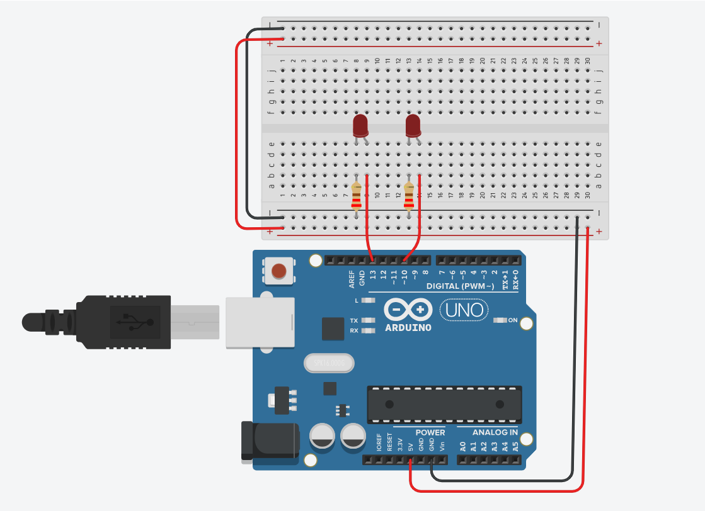
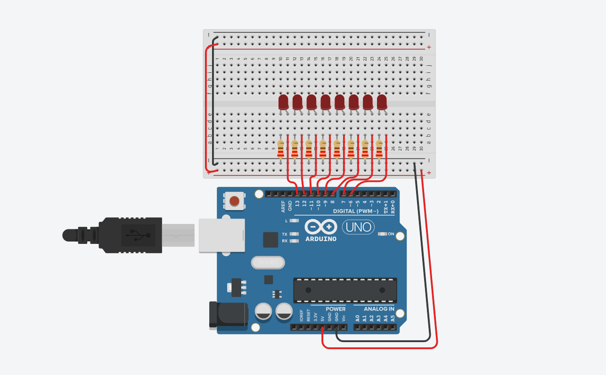
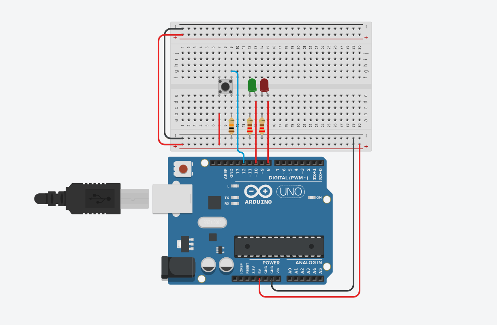
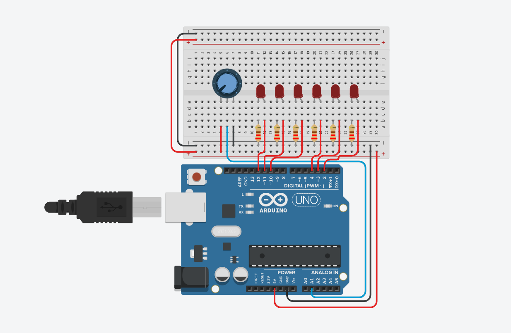
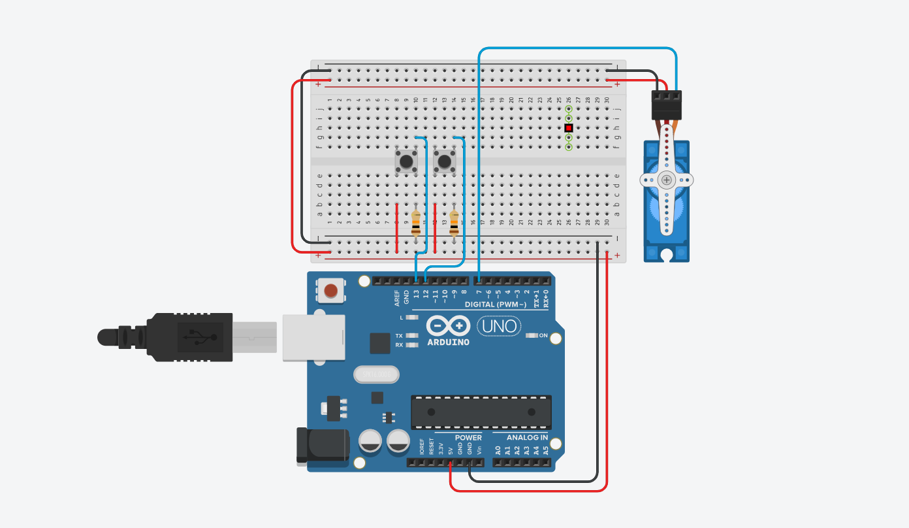
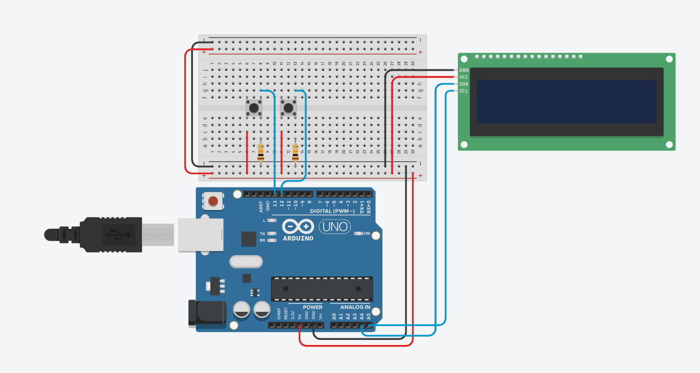

# Hardware_Interfacing

### Description
This repo contains all six parts of the hardware interfacing project. Each map is named after the part it contains. 

>AssignmentThree

For each of the six assignments I will list the hardware needed to build the setup. The parts listed is the hardware used for each assignment. I won't list the fact that **each assignment uses one UNO board and one breadbord** since these amounts don't change. Each list is followed by an image of the hardwares layout. I'll also incluse links to the video containing a demonstration of the working hardware. Each video is placed the playlist for this assignment on my youtube. 

#### Assignment One
The goal for this assignment was to have two LEDs take turns going on for 1,5 seconds. 
[Assignment one demo](https://www.youtube.com/watch?v=zhNSA-LwCfU&list=PL70anwdMR-KeF5odibf5x1I3OigQKqlzQ)
| LED | Resistor(220Ω) | Wire |
|:-------:|:-------:|:--------:|
| Two | Two | Four |

#### Assignment Two
The goal here was to have eight LEDS light up back and forth like KITT in the film Knight Rider. 
[Assignment two demo](https://www.youtube.com/watch?v=iFsQ3T2spyQ&list=PL70anwdMR-KeF5odibf5x1I3OigQKqlzQ&index=2)
| LED | Resistor(220Ω) | Wire |
|:-------:|:-------:|:--------:|
| Eight | Eight | Ten |

#### Assignment Three
For this assignment I had to install two LEDs and a button. The first LED had to be on, the second one off. Should the button be pressed I had to make the LEDs switch, so the first one should turn off and the second one on. Another press of the button would revert this
and so on. 
[Assignment three demo](https://www.youtube.com/watch?v=GONzmsXM2T8&list=PL70anwdMR-KeF5odibf5x1I3OigQKqlzQ&index=3)
| LED | Resistor(220Ω) | Button | Resistor(10KΩ) | Wire |
|:-------:|:-------:|:--------:|:--------:|:--------:|
| Two | Two | One | One | Six |

#### Assignment Four
In this assignment I had to work with the potentiometer and six LEDs. The goal was to have all six LEDs on when the potentiometer was all the way to the left. When turning the potentiometer to the right more and more LEDs had to shut off the further you turned it. 
[Assignment four demo](https://www.youtube.com/watch?v=7HiY82RpudU&list=PL70anwdMR-KeF5odibf5x1I3OigQKqlzQ&index=4)
| LED | Resistor(220Ω) | Potentiometer | Wire |
|:-------:|:-------:|:--------:|:--------:|
| Six | Six | One | Eleven |

#### Assignment Five
In this assignment I had to use two buttons and a servomotor. While holding button one the servomotor had to turn to 120° in five seconds and go back to 0°, also in five seconds. 
While holding button two the servomotor had to turn to 120° in half a second and go back to 0°, also in half a second. 
while holding both buttons at the same time the servomotor had to go to 120° in five seconds, pause for two seconds and then go back to 0° in half a second. 
Having to hold the button meant the servomotor had to stop the action when you let go. 
[Assignment five demo](https://www.youtube.com/watch?v=GCF1p4zLURw&list=PL70anwdMR-KeF5odibf5x1I3OigQKqlzQ&index=5)
| Button | Resistor(10KΩ) | Servomotor | Wire |
|:-------:|:-------:|:--------:|:--------:|
| Two | Two | One | Nine |

#### Assignment Six
The last assignment! For this one the instructions are as follows. I had to use a LCD screen and two buttons. When pressing the first button a timer had to start on the display. While holding the first button, after two seconds the screen had to show that time as a lap underneath the running timer. If the second button would be pressed the timer had to pause (and continue when pressing the first one again). Lastly when clicking both buttons at the same time, the timer had to reset. Just like a real stopwatch!
[Assignment six demo](https://www.youtube.com/watch?v=eXwGqUtvnNA&list=PL70anwdMR-KeF5odibf5x1I3OigQKqlzQ&index=6)
| Button | Resistor(10KΩ) | LCD (I2C) | Wire |
|:-------:|:-------:|:--------:|:--------:|
| Two | Two | One | Ten |

